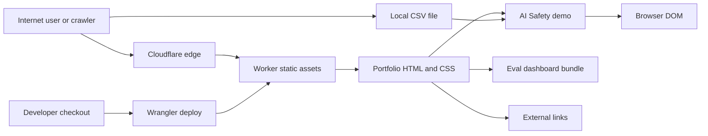

## Executive summary

This repository is a public, Cloudflare-hosted static portfolio site. The highest-risk areas are not server-side compromise paths, because there is no app server, auth, database, or first-party API in scope. The realistic risks are client-side script injection in the interactive demos, accidental publication of local/development files through the static asset deploy path, and missing or dashboard-only edge security controls that are hard to review from the repo alone.

## Scope and assumptions

In scope:

- Repository root: `/Users/nitish/VS Code Projects/tpm-portfolio/nitishprasad-website`
- Static pages: `index.html`, project pages, `resume.html`, legal pages, `portfolio-refresh.css`
- Interactive demos served as static assets: `ai-safety/index.html`, `evals/index.html`, `evals/assets/index-dUPLY1xV.js`
- Cloudflare Worker static-assets deployment and edge configuration, including repo-controlled `_headers` and `.assetsignore`
- Crawler support files: `robots.txt`, `sitemap.xml`, `llms.txt`

Out of scope:

- Security of linked external sites such as GitHub, LinkedIn, and `www.sproutroute.app`
- Source repositories behind the case studies, except as linked public destinations
- Cloudflare account security controls that are not visible from repo files or runtime headers, such as MFA and dashboard RBAC

Assumptions:

- Production is served through Cloudflare Worker static assets for `nitishprasad.com` and `www.nitishprasad.com`; prior deploy evidence and current live headers support this.
- The site is intentionally public, recruiter-facing, and crawlable; `robots.txt` allows all user agents.
- `/ai-safety/` is a self-contained public demo. CSV upload is local browser processing, not a production data ingestion workflow.
- There is no first-party auth, cookie/session state, database, or API endpoint in this repository.

Open questions that would materially change ranking:

- Whether Cloudflare dashboard has Transform Rules, WAF rules, bot controls, or account-level security headers beyond this repo.
- Whether future demo pages will accept remote data, network uploads, or user-generated content.
- Whether the live Worker is always deployed from this exact directory with `.assetsignore` and `_headers` present.

## System model

### Primary components

- Static portfolio pages: plain HTML and CSS with small inline menu scripts. Evidence: `README.md:21-25`, `index.html:484-499`.
- AI Safety demo: single static HTML file with local scenario generation, CSV parsing, local report export, and escaped HTML rendering. Evidence: `ai-safety/index.html:1131-1145`, `ai-safety/index.html:1208-1230`, `ai-safety/index.html:900-910`.
- AI Eval Control Tower demo: static React/Vite-style bundle loaded from `/evals/assets`. Evidence: `evals/index.html:7-10`.
- Cloudflare static-assets deploy boundary: `.assetsignore` blocks sensitive local artifacts; `_headers` declares repo-controlled security headers. Evidence: `.assetsignore:1-11`, `_headers:1-6`.
- Public crawler metadata: `robots.txt`, `sitemap.xml`, and `llms.txt` intentionally expose page inventory. Evidence: `robots.txt:1-6`, `sitemap.xml:3-68`, `llms.txt:1-26`.

### Data flows and trust boundaries

- Internet user -> Cloudflare edge -> static assets: public HTTP requests for HTML, CSS, JS, images, metadata. TLS/HSTS and `X-Content-Type-Options` are visible live; `_headers` now adds CSP, frame, referrer, and permissions policy for future deploys.
- Browser -> static HTML scripts: user clicks and menu state changes in same-origin pages. No server persistence; inline scripts require a CSP with `'unsafe-inline'` until scripts are externalized or hashed.
- Browser local file -> `/ai-safety/` CSV parser -> DOM: attacker-controlled CSV content can cross from local file into computed metrics and tables. Patched rendering escapes text and attribute values before `innerHTML` insertion.
- Portfolio page -> same-origin iframe demos: case-study pages embed `/ai-safety/` and `/evals/` with same-origin frames. `_headers` uses `frame-ancestors 'self'` and `X-Frame-Options: SAMEORIGIN` so same-site embeds continue working while external framing is blocked.
- Portfolio page -> external destinations: users click GitHub, LinkedIn, and demo links. External links use `target="_blank"` with `rel` values, reducing opener exposure; referrer leakage is reduced by `_headers`.
- Developer machine -> Wrangler static-asset upload -> Cloudflare: everything not ignored can become public. `.assetsignore` excludes `.git`, `.claude`, `.DS_Store`, `.gitignore`, `.assetsignore`, stale review artifacts, old OG images, security reports, and `docs`.

#### Diagram

## Assets and security objectives

| Asset | Why it matters | Security objective (C/I/A) |
|---|---|---|
| Public portfolio content | Recruiters and AI tools use it to evaluate the candidate; tampering harms credibility | Integrity, availability |
| Resume/contact details | Public but should not be altered or spoofed | Integrity |
| Demo browser execution context | Same origin as portfolio pages; XSS can manipulate page content and downloads | Integrity |
| Static asset deploy contents | Accidental upload can expose repo metadata, local configs, or work notes | Confidentiality |
| Cloudflare routes and edge rules | Misconfiguration can remove headers, expose files, or break canonical redirects | Integrity, availability |
| Crawler metadata | Intended to guide search/AI access; poisoning could misrepresent canonical pages | Integrity |

## Attacker model

### Capabilities

- Remote unauthenticated visitor can request any public path and inspect all client-side code.
- Remote visitor can click or share links and try to frame the site from another origin.
- Visitor can upload a malicious CSV into the local `/ai-safety/` demo in their own browser.
- Anyone with deploy access or a compromised local checkout can accidentally or intentionally publish extra static files.
- Crawler/bot operators can consume `robots.txt`, `sitemap.xml`, `llms.txt`, and visible HTML.

### Non-capabilities

- No direct access to server-side secrets from this repo because no server-side code or secret-bearing env files were found.
- No authenticated user data or cross-tenant data to steal from the site itself.
- No persistent storage path in `/ai-safety/`; malicious CSV content is not stored server-side.
- No first-party API routes or request handlers are present in the repo.

## Entry points and attack surfaces

| Surface | How reached | Trust boundary | Notes | Evidence (repo path / symbol) |
|---|---|---|---|---|
| Static pages | Public GET requests | Internet -> Cloudflare -> assets | Main public content; small inline scripts | `README.md:21-25`, `index.html:484-499` |
| `/ai-safety/` CSV upload | Browser file picker | Local file -> parser -> DOM | Self-contained, local-only, but file content is untrusted | `ai-safety/index.html:1208-1230` |
| `/ai-safety/` HTML rendering | Demo render functions | Computed/user-derived values -> `innerHTML` | Escaped after patch | `ai-safety/index.html:900-910`, `ai-safety/index.html:940-1065` |
| `/evals/` bundle | Public GET requests | Static JS bundle -> browser | Large static JS bundle; no source maps found | `evals/index.html:7-10` |
| Same-origin iframes | Case-study pages | Parent page -> embedded demo | Needs same-origin framing but not third-party framing | `project-ai-safety.html:224-225`, `ai-eval-control-tower.html:237-238` |
| External links | User clicks | Portfolio origin -> third parties | Uses `rel` values on `_blank` links | `resume.html:54-55`, `project-sproutroute.html:47-58` |
| Static deploy upload | Wrangler deploy | Developer checkout -> Cloudflare assets | `.assetsignore` is critical | `.assetsignore:1-11` |
| Edge headers | Cloudflare static asset response | Cloudflare -> browser policy enforcement | `_headers` added; live verify after deploy | `_headers:1-6` |

## Top abuse paths

1. CSV-to-DOM injection: attacker sends a crafted CSV -> user opens it in `/ai-safety/` -> CSV group values reach demo tables -> injected HTML executes. Impact is same-origin browser manipulation. Patched by escaping render sinks.
2. Missing edge CSP increases XSS blast radius: a future HTML injection bug lands in a public page -> no CSP limits script execution or framing -> attacker manipulates visible portfolio/demos. `_headers` now adds baseline CSP.
3. Accidental static asset exposure: developer deploys whole repo -> `.git`, local config, notes, or dotfiles are uploaded -> public can request sensitive files. Current `.assetsignore` and live 404 checks reduce this risk.
4. External clickjacking: attacker frames the portfolio or demos -> user interacts with spoofed overlays -> reputational or social-engineering harm. `_headers` now uses same-origin framing only.
5. Search/AI poisoning by repo drift: stale `sitemap.xml` or `llms.txt` points crawlers to outdated or wrong pages -> AI/recruiter summaries misrepresent the portfolio. Keep crawler files synchronized with page inventory.
6. Third-party font/script dependency drift: external font load or Cloudflare-injected scripts interact with future CSP changes -> pages break or policy is weakened. Current CSP allows required self/Google font sources and inline scripts pending externalization.

## Threat model table

| Threat ID | Threat source | Prerequisites | Threat action | Impact | Impacted assets | Existing controls (evidence) | Gaps | Recommended mitigations | Detection ideas | Likelihood | Impact severity | Priority |
|---|---|---|---|---|---|---|---|---|---|---|---|---|
| TM-001 | Malicious CSV author | User opens attacker-supplied CSV in self-contained demo | Inject HTML/JS through CSV fields rendered into demo tables | Same-origin DOM manipulation and misleading exported report | Demo execution context, portfolio integrity | CSV parser and file handling in `ai-safety/index.html:1131-1145`, `ai-safety/index.html:1208-1230`; escaping added in `ai-safety/index.html:900-910` and render sinks | CSV parser is simple and still accepts arbitrary text; CSP still allows inline scripts for existing pages | Keep escaping, add regression test with malicious CSV, consider building DOM nodes instead of `innerHTML` | Browser test that renders `` CSV and checks no injected nodes | Medium before patch; low residual | Medium | Medium |
| TM-002 | Remote web attacker | Any future injection or compromised static content | Execute script in portfolio origin | Defacement, misleading contact links, fake downloads | Public content integrity | `_headers:1-6` adds CSP, frame controls, referrer and permissions policy | CSP requires `'unsafe-inline'` because current pages use inline scripts | Externalize common menu scripts and use stricter CSP without `'unsafe-inline'` | Runtime header check for CSP; crawler/browser console CSP violation monitoring | Medium | Medium | Medium |
| TM-003 | Accidental deploy exposure | Developer deploys repo root with sensitive local files | Publish dotfiles, Git metadata, or local tool config as static assets | Confidentiality leak and possible repo/account reconnaissance | Static deploy contents | `.assetsignore:1-11`; live checks returned 404 for `.git`, `.DS_Store`, `.assetsignore`, `.claude/settings.local.json` | Future new dotfiles may not be covered | Keep `.assetsignore` denylist broad; add deploy verification script for internal paths | Post-deploy curl checks for `.git/HEAD`, `.env`, `.DS_Store`, `.claude/settings.local.json` | Low | High | Medium |
| TM-004 | Clickjacking attacker | Site can be framed by third-party origin | Embed page/demo in hostile frame | User confusion, social engineering, content spoofing | Portfolio integrity, user trust | `_headers:1-6` sets `X-Frame-Options: SAMEORIGIN` and `frame-ancestors 'self'` | Must verify after deploy; same-origin iframes intentionally remain allowed | Deploy `_headers`; verify external frame attempts fail | Runtime header check and browser frame test | Medium before patch; low residual | Low | Low |
| TM-005 | Content/crawler poisoning via repo drift | `robots.txt`, `sitemap.xml`, or `llms.txt` diverges from real pages | Mislead crawlers, AI tools, or recruiters | Wrong page inventory or stale portfolio summary | Crawler metadata integrity | `robots.txt:1-6`, `sitemap.xml:3-68`, `llms.txt:1-26` | No automated sitemap/link validation visible | Add link checker and sitemap consistency check before deploy | CI or local script comparing sitemap URLs with existing files and live status | Medium | Low | Low |
| TM-006 | Cloudflare dashboard/config drift | Edge settings changed outside repo | Disable headers, alter routes, expose Worker URL unexpectedly | Security posture depends on unreviewed dashboard state | Edge controls, public routes | Repo now has `_headers:1-6`; live headers currently show HSTS and nosniff | Dashboard controls are not captured in repo | Keep headers in repo, document deploy command, verify live headers after deploy, review Cloudflare RBAC/MFA separately | `curl -I` checks for CSP, frame, referrer, permissions headers on `/`, `/ai-safety/`, `/evals/` | Medium | Medium | Medium |

## Criticality calibration

- Critical: Not expected in current repo. Would require pre-auth server-side code execution, Cloudflare account takeover, secret-bearing `.env` exposure, or persistent compromise of public content at scale.
- High: Accidental publication of secrets or Git history; malicious deploy route change; persistent public defacement of portfolio pages; cross-origin access to sensitive future user data if APIs are added.
- Medium: Client-side XSS in a public demo, missing browser security headers, dashboard drift that weakens runtime policy, or deploy exposure of non-secret local metadata.
- Low: Stale crawler metadata, opener/referrer hygiene issues, clickjacking without sensitive actions, or issues requiring a user to attack their own browser with local files.

## Focus paths for security review

| Path | Why it matters | Related Threat IDs |
|---|---|---|
| `ai-safety/index.html` | Main untrusted-input surface due local CSV parsing and dynamic table rendering | TM-001, TM-002 |
| `_headers` | Repo-owned Cloudflare static-assets security header baseline | TM-002, TM-004, TM-006 |
| `.assetsignore` | Prevents local/dev files from becoming public static assets | TM-003 |
| `evals/index.html` | Loads the static React bundle and external fonts | TM-002, TM-006 |
| `evals/assets/index-dUPLY1xV.js` | Large browser-executed bundle; review if regenerated or made data-driven | TM-002 |
| `project-ai-safety.html` | Embeds same-origin AI Safety demo | TM-004 |
| `ai-eval-control-tower.html` | Embeds same-origin eval demo | TM-004 |
| `robots.txt` | Controls crawler/AI access posture | TM-005 |
| `sitemap.xml` | Canonical public URL inventory | TM-005 |
| `llms.txt` | AI-reader summary surface | TM-005 |
| `resume.html` | Contact and resume page; print action was patched away from `javascript:` URL | TM-002 |

## Quality check

- Covered all discovered entry points: static pages, `/ai-safety/`, `/evals/`, iframe embeds, external links, crawler files, and deploy upload path.
- Represented each trust boundary in the threats: internet-to-assets, local CSV-to-DOM, parent-to-iframe, developer-checkout-to-Cloudflare, and repo-to-crawler.
- Separated runtime from CI/dev: deploy upload and `.assetsignore` are modeled separately from browser runtime.
- Reflected user clarifications: Cloudflare edge/dashboard context is in scope; `/ai-safety/` is a self-contained demo; fixes were applied.
- Open assumptions remain explicit, especially dashboard-only Cloudflare controls and post-deploy live header verification.
